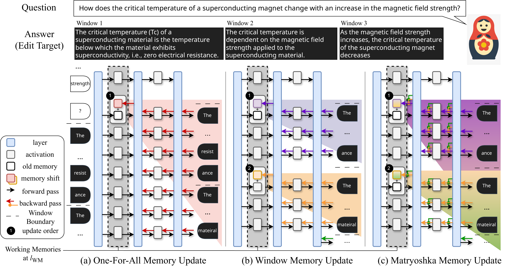

# μKE: Matryoshka Unstructured Knowledge Editing of Large Language Models

<div align="center">

[](https://colmweb.org/)
[](https://arxiv.org/abs/2504.01196)
[](https://arxiv.org/pdf/2504.01196)
[](https://muke.sheepy.me)
[](https://www.python.org/downloads/)

</div>

This repository contains the official implementation of the paper "[μKE: Matryoshka Unstructured Knowledge Editing of Large Language Models](https://arxiv.org/abs/2504.01196)", accepted at COLM 2025.

## 📄 About

<div align="center" style="padding: 20px;">
  
  <p><em>Comparison between different unstructured editing paradigms. (a) One-for-All updates one memory for the entire edit target. (b) Window-by-Window splits the target into windows but overlooks memory dependencies. (c) Our Matryoshka approach maintains proper dependency while benefiting from multiple memory shifts.</em></p>
</div>

Large language models (LLMs) have emerged as powerful knowledge bases yet are limited by static training data, leading to issues such as hallucinations and safety risks. Editing a model's internal knowledge through the locate-and-edit paradigm has proven a cost-effective alternative to retraining, though current unstructured approaches, especially window-based autoregressive methods, often disrupt the causal dependency between early memory updates and later output tokens. In this work, we first theoretically analyze these limitations and then introduce Matryoshka Unstructured Knowledge Editing (μKE), a novel memory update mechanism that preserves such dependencies via a Matryoshka-style objective and adaptive loss coefficients. Empirical evaluations on two models across four benchmarks demonstrate that μKE improves edit efficacy by up to 12.33% over state-of-the-art methods, and remains robust when applied to diverse formatted edits, underscoring its potential for effective unstructured knowledge editing in LLMs.

## 📜 Table of Contents

- [🚀 Getting Started](#getting-started)
  - [💻 Installation](#installation)
  - [📊 Data](#data)
- [💡 Usage](#usage)
  - [✍️ Editing](#editing)
  - [✅ Evaluation](#evaluation)
- [🎓 Citation](#citation)

## 🚀 Getting Started

### 💻 Installation

1.  **Clone the repository:**
    ```bash
    git clone https://github.com/PurCL/muke.git
    cd muke
    ```

2.  **Create a conda environment:**
    ```bash
    conda create -n muke python=3.10
    conda activate muke
    ```

3.  **Install dependencies using uv:**
    ```bash
    pip install uv
    uv pip install -r pyproject.toml
    ```


## 💡 Usage

### 🚀 Quick Start

We provide convenient scripts for quick experimentation:

-   **`1-demo_edit.sh`**: Run a quick demo edit with μKE on 10 samples
-   **`2-summarize.sh`**: Summarize evaluation results from any experiment

```bash
# Quick demo: Run μKE on 10 UnKE samples with Qwen2.5-7B
./1-demo_edit.sh

# Summarize results from any experiment
./2-summarize.sh path/to/your/results.json
```

### ✍️ Editing

For full experiments, use the evaluation script directly:

```bash
python -m experiments.evaluate_uns \
    --alg_name {METHOD_NAME} \
    --model_name {MODEL_NAME} \
    --hparams_fname {HPARAMS_FILE} \
    --ds_name {DATASET_NAME} \
    --dataset_size_limit {SIZE_LIMIT} \
    --num_edits {NUM_EDITS}
```

-   `{METHOD_NAME}`: The editing method (e.g., `unke_Mat`, `memit`)
-   `{MODEL_NAME}`: The model to edit (e.g., `Qwen/Qwen2.5-7B-Instruct`, `meta-llama/Llama-3-8B-Instruct`)
-   `{HPARAMS_FILE}`: Hyperparameter file (e.g., `Qwen2.5-7B-Instruct-matryoshka.json`)
-   `{DATASET_NAME}`: Dataset to use (`unke`, `mquake`, `cf`, `editevery`)
-   `{SIZE_LIMIT}`: Number of samples to process (optional)
-   `{NUM_EDITS}`: Number of edits per sample (default: 1)


### ✅ Evaluation

Results are automatically saved after each experiment. To summarize the results:

```bash
python -m experiments.summarize_uns --file_path path/to/results.json
```

## 🎓 Citation

If you find our work useful, please consider citing our paper:

```bibtex
@misc{su2025muke,
      title={$\mu$KE: Matryoshka Unstructured Knowledge Editing of Large Language Models}, 
      author={Zian Su and Ziyang Huang and Kaiyuan Zhang and Xiangyu Zhang},
      year={2025},
      eprint={2504.01196},
      archivePrefix={arXiv},
      primaryClass={cs.CL},
      url={https://arxiv.org/abs/2504.01196}, 
}
```
